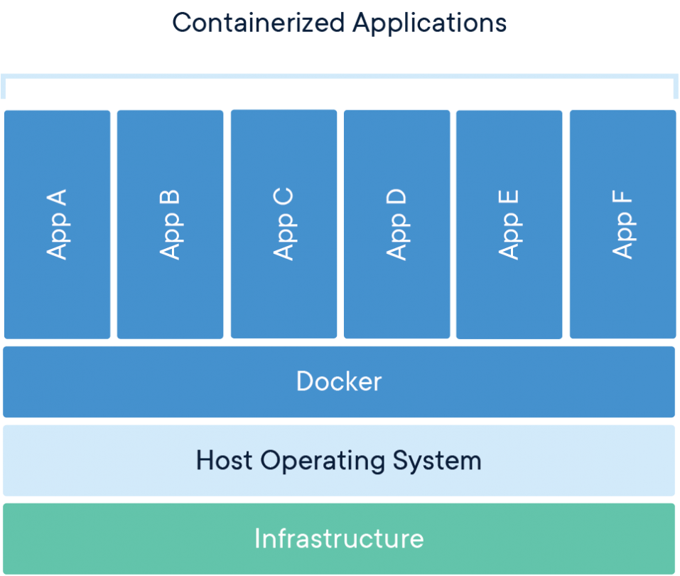
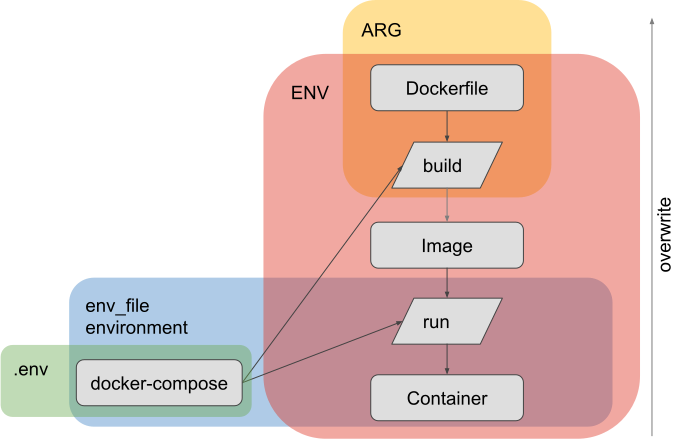
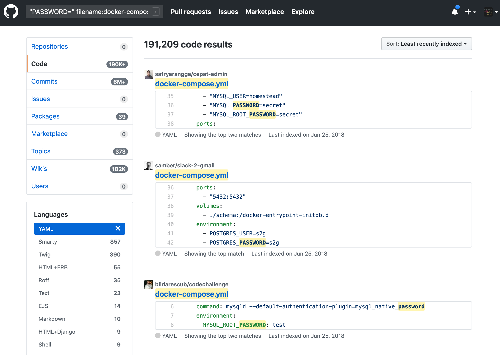
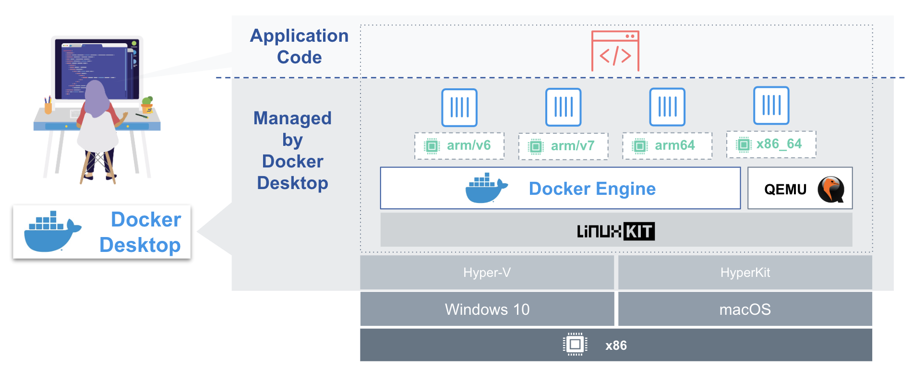
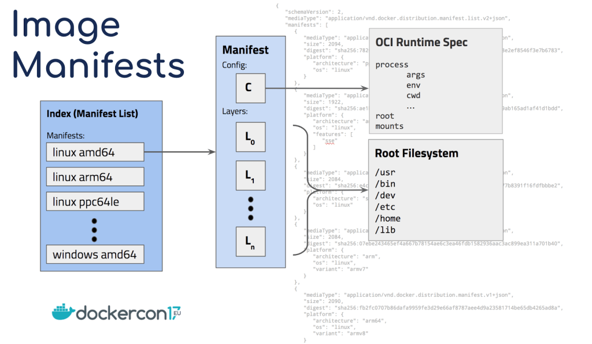
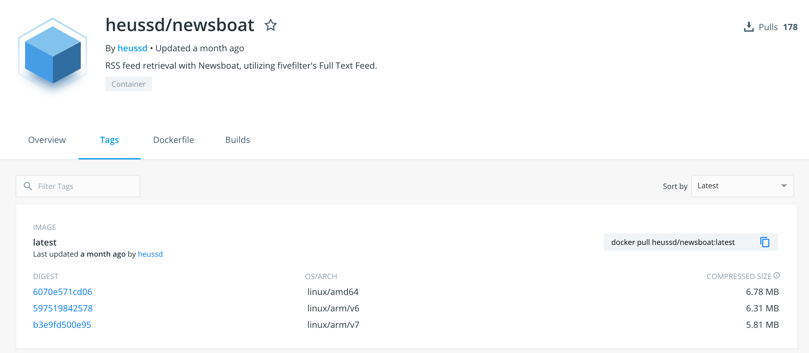
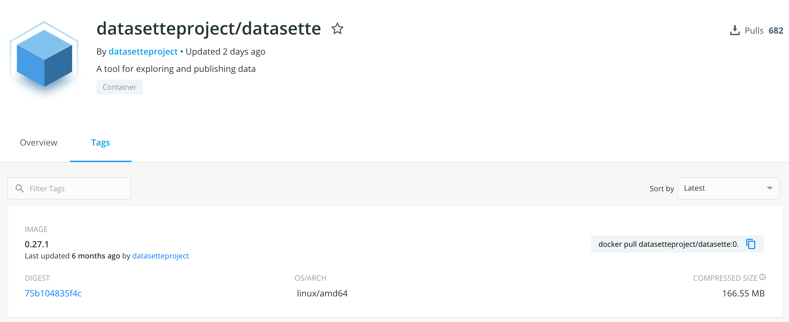

<!-- .slide: data-background="https://images.pexels.com/photos/163726/belgium-antwerp-shipping-container-163726.jpeg" data-state="intro"-->

# Docker Late 2019

by Timm Heuss

---

## Topics Covered

- Recap: What’s Docker
- BuildKit
- The most important Docker rules
- Docker and Docker Compose
- Bind Mounts / Volumes
- Handling Large Models
- ARG vs. ENV vs. .env vs. env_file
- Docker Secrets

- ENTRYPOINT vs. CMD vs. RUN
- BuildKit Mount Types / “Application Caching”
- Multi-Stage Docker Images
- Useful Tools: dive, lazydocker, dcc
- Multi-Architecture Images
- Docker Pitfalls

🤚 Includes a hands-on session in which we interactively optimize an existing Dockerfile
---

## Recap: What's Docker?

[https://www.docker.com/resources/what-container](https://www.docker.com/resources/what-container)

----

### Docker Vocabulary

---

## New in the Docker World: BuildKit

BuildKit is a new building and packaging software for Docker

- 🔥 Build caches & mount types
- 🔥 Concurrent multistage builds
- 🔥 Multi CPU architecture builds (e.g. linux/amd64, linux/arm)

----
### How to enable

Enabling BuildKit on your machine (Docker >= 18.09):
- Command line
	
		docker buildx
		
- Environment Variable
	
		DOCKER_BUILDKIT=1
		
- Daemon config

		{ "features": { "buildkit": true }}

---

## The most important Docker rules

1. Reduce the size of our shipment, because it reduces
	- … the amount of required (cloud) storage
	- … transferring times
	- … the attack surface

1. Reduce build time, because
	- …	only fast builds will be executed frequently

1. Make builds reproducible

In contrast to a widespread opinion, I don’t care about the number of layers you use

---
## Dockerfile + docker-compose.yml

Standardized and reproducable definition of image name, runtime parameters, ports, volumes etc…

----
### Via Command Line only

	docker build . -t myveryspecialname:1.0
	
	docker run -p “8080:8080” -v “/var/folder:/sth:ro” myveryspecialname:1.0
	
	
- 👎 cannot be put into git
- 👎 easy to mess-up
- 👎 hard to remember
- 👎 individual for every image and machine

Custom builds scripts / makefiles are helping, but they are introducing individualism that is unwanted here

----
### Using the Docker-Compose file

Command Line
	
	//old way: docker-compose build
	
	docker buildx bake
	
	docker-compose up

docker-compose.yml

~~~yaml
image: myveryspecialname:1.0
build: .
ports:
 - 8080:8080
volumes:	
 - "/var/somespecialfolder:/sth:ro"
~~~

- 👍 can be versioned
- 👍 syntax highlighting and check
- 👍 write and forget - no remembering needed!
- 👍 works on all machines with every image 

---

## Bind Mounts and Volumes

[https://docs.docker.com/storage/bind-mounts/](https://docs.docker.com/storage/bind-mounts/)

----
#### Bind Mounts

Allow to share a file or folder with the host system

- typically used for persisting database / index / setting files
- Performance?!
	- “like native” on Linux (VFS)
	- “it depends” on macOS / Windows (non-VFS hosts)
- since 17.04, we have more options to define consistency expectation:
	- `consistent` - default, perfect consistency, can be expensive ⚠️
	- `cached` - the host’s view is authoritative
	- `delegated` - the container’s view is authoritative
----

### Verbose bind mount syntax 

~~~yml
services:
  service:
    volumes:
      - type: bind
        source: ${PWD}/data/
        target: /data
        consistency: cached
        read_only: true
~~~

----
#### Volumes

allow to persist a file or folder across container instances
- typically used for persisting (regenerated)  index / cache files
- volumes are not easily explorable / transferable to different hosts

---

## Handling Large Data Dependencies

The real question is: what is your load scenario?

----

### 4 Strategies on Tackling large Data dependencies

- Bake it into the image
	- Docker images should be self-contained and easy to use
	- Code and Data Dependency are logically tightly coupled, so why not ship them coupled together?

- Cluster architectures
	- Some Databases and Search Engines can be operated as cluster
	- These applications know best how to scale themselves

- Model Server
	- [TensorFlow Serving](https://www.tensorflow.org/tfx/guide/serving) provides versioning, hosting and provisioning capabilities for machine learning models
	- ML lifecycle is better supported

- Distributed File Systems
	- There are some file systems for distributed use, such as Ceph-FS or GlusterFS

---

## ARG vs. ENV vs. .env vs. env_file

Hierarchy and scope of variables in Docker

----

- Dockerfile variable definitions
	- Arguments (valid during build)
	
			ARG myvar=variable
			
	- Environment Variables (valid during build and run)
	
			ENV myvar=variable

- Docker-Compose variable definitions
	- Environment Statement (valid during run)
	
			environment:
				myvar1=variable
				myvar2=${SYSENV:-fallback}
				
	- `env_file` Statement (valid during run)
	
			env_file: env_file_name
- Do not use any of this for passwords!

---
## Passwords in Environment Variables?

This is considered to be bad practice!

They violate the **principle of least privilege** and the **principle of least astonishment**:

1. Everyone can find out the environment of a process
1. Environments are often printed for error reporting or debugging purposes
1. Environments are inherited to all child-processes
1. Misuse is too easy

----

---
## Secrets

Handling secrets the _Docker way_ involves two steps:

1. Use what Docker provided to us for passwords
2. Adjust our Docker image entrypoint

----
### Use what Docker provided to us for passwords

1. Define the secret with a **name** and with a **reference to a txt file**
1. Assign the secret to a container. 

		services:
		  service:
		    secrets:
		      - my_secret
		secrets:
		  my_secret:
		    file: ./my_secret.txt

1. Inside the container, the secrets is available at

		/run/secrets/name

----
### Adjust our Docker image entrypoint

4. Instead of defining the password via environment variable

		SQL_DB_PASSWORD=mysecretpassword
			
 It is current practice to add the suffix **_FILE** and to refer to a secret path

		SQL_DB_PASSWORD_FILE=/run/secrets/sql-db-password
1. Custom entrypoint scripts resolve the path in SQL_DB_PASSWORD_FILE and create a local variable SQL_DB_PASSWORD with its content. Example: [MySQL Entrypoint](https://github.com/docker-library/mysql/blob/master/5.6/docker-entrypoint.sh)

~~~bash
# usage: file_env VAR [DEFAULT]
#    ie: file_env 'XYZ_DB_PASSWORD' 'example'
# (will allow for "$XYZ_DB_PASSWORD_FILE" to fill in the value of
#  "$XYZ_DB_PASSWORD" from a file, especially for Docker's secrets feature)
file_env() {
~~~
---

## RUN, ENTRYPOINT, CMD

**RUN**
- Executed during build phase
- Commits a new layer to the Docker image
- Example: Install dependencies
	
		RUN apt-get install glibc

**ENTRYPOINT**
- Executed during ⚠️ run phase
- Example: Define a server start 

		ENTRYPOINT java /app.jar -serve

**CMD**
- Allows to augment `ENTRYPOINT` with addition parameters
- Example: Add additional parameters 

		CMD -Xmx4G

---

## New BuildKit Mount Types (experimental)

- A new experimental Dockerfile frontend syntax allows us to add cool new features to `RUN` commands:
		
		RUN --mount=type=<type>,target=<target> <path-to-app>	

- To enable the experimental frontend, add this line to your `Dockerfile`

		# syntax = docker/dockerfile:experimental

----

### Bind mounts

	RUN --mount=type=bind,target=/sth/ cat /sth/lala

- Bind-mounts an external folder (read only)
- Suitable for large file dependencies or source code

----

### Cache mounts

	RUN --mount=type=cache,target=/root/.m2 mvn package
	
	RUN --mount=type=cache,target=/var/lib/apt/lists apt update
	
	RUN --mount=type=cache,target=/root/.cache/pip pip update
	
	RUN --mount=type=cache,target=/root/.cache/go-build go build

- Caches a specified folder across builds
- Suitable for dependencies and repositories

----
### See also

~~~dockerfile
RUN --mount=type=secret
~~~

~~~dockerfile
RUN --mount=type=ssh
~~~

[https://github.com/moby/buildkit/blob/master/frontend/dockerfile/docs/experimental.md](https://github.com/moby/buildkit/blob/master/frontend/dockerfile/docs/experimental.md)

---

## Multi-Stage - Dos and Don'ts

Good

	FROM ubuntu as build
	RUN … // build your stuff here
	
	FROM alpine
	COPY --from=build artifact.bin /
	
	ENTRYPOINT ./artifact.bin
	
Recommended good practice

Bad

~~~dockerfile
	FROM ubuntu as build
	RUN … // build your stuff here
	
	FROM alpine as base
	COPY --from=build artifact.bin /
	
	ENTRYPOINT ./artifact.bin
	
	FROM base as debug
	ENV	debug=1
	
	FROM base as prod
	ENV	debug=0
	ENV prod=1
~~~

- ⚠️ Images cannot be distinguished by their build stage
- ⚠️ Mix of configuration and the resulting build artifact

---
## Multi-Stage: Installing vs Base Images

The work from others can be integrated more easily.

Example scenario: The `git` command is required during the build of an image. What can we do?

----

### Ubuntu

~~~dockerfile
FROM ubuntu # 64 MB
~~~

Install git

~~~dockerfile
# + 122 MB
RUN   apt-get update && \
      apt-get install -y git
~~~

Install git, leave-out recommended stuff

~~~dockerfile	
# + 102 MB
RUN   apt-get update && \
      apt-get -y install --no-install-recommends \
	  git
~~~

Install git, leave-out recommended stuff, remove repository cache

~~~dockerfile	
# + 77 MB
RUN   apt-get update && \
      apt-get -y install --no-install-recommends \
      git \
      && rm -rf /var/lib/apt/lists/*
~~~

141 MB in total - 75% of the straight forward installation!

----

### alpine

~~~dockerfile	
FROM alpine # 5,6 MB
~~~

Install git

~~~dockerfile	
#  + 17 MB
RUN   apk add --update git
~~~

Install git, don't cache repository

~~~dockerfile	
# + 16 MB
RUN   apk add --no-cache --update git
~~~

21,6 MB in total - only 15% of the size of the smallest Ubuntu image 

----
#### alpine/git

	FROM   alpine/git # 28 MB

- No brainer
- Use what others did better

---

## Maven Dockerfile Boilerplate 2019

~~~dockerfile
# syntax = docker/dockerfile:experimental

FROM    maven:3.5.0-jdk-8-alpine as build
WORKDIR /app

RUN     --mount=target=. --mount=type=cache,target=/root/.m2/ \
		mvn package -DbuildDirectory=/target

FROM    openjdk:8-alpine
RUN     apk add --no-cache --update curl
WORKDIR /
COPY    --from=build /target/*-standalone.jar /app.jar
ENTRYPOINT ["java", "-jar", "/app.jar"]
CMD		-Xmx=2G

EXPOSE  8080

HEALTHCHECK   --interval=2m --timeout=10s CMD\
			curl --fail http://0.0.0.0:8080/health || exit 1
~~~

----
### Experimental Mounts for the Maven execution

~~~dockerfile
RUN     --mount=target=. --mount=type=cache,target=/root/.m2/ \
		mvn package -DbuildDirectory=/target
~~~

- Mount bind of the external Java-Source folder
- No `COPY` of the sources, creation of one layer saved
- No previous dependency management, creation of another layer saved
- Cache mount of `/root/.m2/`, dependencies stored there will be cached across image builds
- Maven must be instructed to use a different output directory, via `-DbuildDirectory=/target`, requires minor changes in the pom.xml:

		<project
			<properties>
				<buildDirectory>${project.basedir}/target</buildDirectory>
			
			<build>
			    <directory>${buildDirectory}</directory>
		
----
### Minimal footprint curl installation

	RUN     apk add --no-cache --update curl

		
----
### CMD augments ENTRYPOINT

	ENTRYPOINT ["java", "-jar", "/app.jar"]
	CMD		-Xmx=2G
	

- Combinational use of `CMD` and `ENTRYPOINT`
- Allows to override application-specific parameters easily, without messing arround with the application execution
- For example, it is easy to assign more heap via docker-compose:

		version: "3.7"
	
		services:
		  service:
		  	build: .
		  	command: -Xmx=4G

----
### Built-in Healthcheck

~~~dockerfile
HEALTHCHECK   --interval=2m --timeout=10s CMD\
			curl --fail http://0.0.0.0:8080/health ||  exit 1
~~~	
			
The container knows best how to monitor its health

---

## Nice Tools

dive, lazydocker, dcc

----
### Dive

A tool for exploring a docker image, layer contents, and discovering ways to shrink the size of your Docker/OCI image.

[https://github.com/wagoodman/dive](https://github.com/wagoodman/dive)

----
### lazydocker

A simple terminal UI for both docker and docker-compose.

[https://github.com/jesseduffield/lazydocker](https://github.com/jesseduffield/lazydocker)

----
### dcc

Builds and launches docker-compose services, monitors their output using multitail, opens exposed ports automatically in a browser.

[https://github.com/heussd/dotfiles/blob/master/scripts/.scripts/dcc](https://github.com/heussd/dotfiles/blob/master/scripts/.scripts/dcc)

---
## Hands-On Session

Demo Scenario: Publishing a Markdown file as static webpage with two dependencies

1. Clone [md-page](https://github.com/oscarmorrison/md-page) - JS that converts Markdown to HTML on the fly
2. Clone [my-way-to-view-things](https://github.com/heussd/my-way-to-view-things) - Timm's prefered CSS for text reading
3. Combine Readme.md + JS + CSS
4. Serve in static Web server

----
### We start with a Dockerfile like this

~~~dockerfile
FROM ubuntu

# Install requirements
RUN   apt-get update && apt-get install -y git lighttpd

WORKDIR /var/www/html/

# Pull dependencies
RUN     git clone https://github.com/oscarmorrison/md-page
RUN		git clone https://github.com/heussd/my-way-to-view-things

# Copy sources
COPY	img ./img/
COPY    Readme.md ./

# Build artifact
RUN 	echo '<noscript>' > 'index.html' && \
			echo '<link rel="stylesheet" type="text/css" href="my-way-to-view-things/text-reading.css" media="screen" />' >> 'index.html' && \
			echo '' >> 'index.html' && \
			cat "Readme.md" >> 'index.html'

# Serve artifact
CMD ["lighttpd", "-D", "-f", "/etc/lighttpd/lighttpd.conf"]
~~~

----
### Deep-dive

1. apt command
	1. We see how many binaries are added for the git installation
	1. We see the apt caches that are added
1. clone command
	1. We notice the `.git` folders

----
### Fixing the Dockerfile

#### Replace the git commands
~~~dockerfile
FROM	alpine/git as git
WORKDIR	/git
RUN		git clone URL /git && \
		git checkout -q "COMMIT"
~~~

	
#### Introduce gostatic

[https://hub.docker.com/r/pierrezemb/gostatic](https://hub.docker.com/r/pierrezemb/gostatic)

#### Build with BuildKit

---
## Demo Recap

By following good practices and  🔥 Docker features, we drastically reduced build time and image size

97% 

size reduction

91% 

build time reduction

- Decreased the attack surface, build time and image size
- Increase scalability and reproducability

---
## Multi-Architecture Images

Image Source: [https://engineering.docker.com/2019/04/multi-arch-images/](https://engineering.docker.com/2019/04/multi-arch-images/)

----
### Image Manifests

Image Source: [https://www.docker.com/blog/multi-arch-all-the-things/](https://www.docker.com/blog/multi-arch-all-the-things/)

----
### How manifest lists are shown

----
### How manifests are shown

----
### How to use

~~~makefile
setup:
	docker buildx create --name "nubuilder" --use
build:
	docker buildx build --platform linux/amd64,linux/arm/v7 -t $(IMAGE_NAME) --push .
clean:
	docker buildx rm nubuilder
~~~

No support for `docker-compose` or `bake` yet 😔

---
## Docker Pitfalls

----

### Terminology: Run 
`RUN` in `Dockerfiles` executes code and commits a new layer during **image build**.

`docker run` executes **containers**.

----

### Terminology: Arguments, Commands
**`ARGS`** are environment variables with the scope of the image build phase.

Runtime **arguments** for a image can be specified using **`CMD`** (`Dockerfile`) or **`commands`** (docker-compose).

Docker **commands** are command line parameters to the Docker binary (such as `docker images`)

----

### Different builds

docker environment variables are respected during build.

docker-compose environment variables are ignored during build, even if you build with `docker-compose build`

----

### Terminology: Volumes and Mounts

[**Volumes** are different from **bind mounts**](https://docs.docker.com/storage/volumes/), but both are specified, used and maintained with the keyword **volumes**.

**Bind mounts** are **volumes** of the **type bind** in docker-compose:

		volumes:
	      - type: bind

----

### Volumes during build

Volumes persist writes during run, but forget writes during build.

Writes during build are ignored silently without any warning.

You cannot be sure what folder is an volume, as images can define arbitrary folders as volumes.

