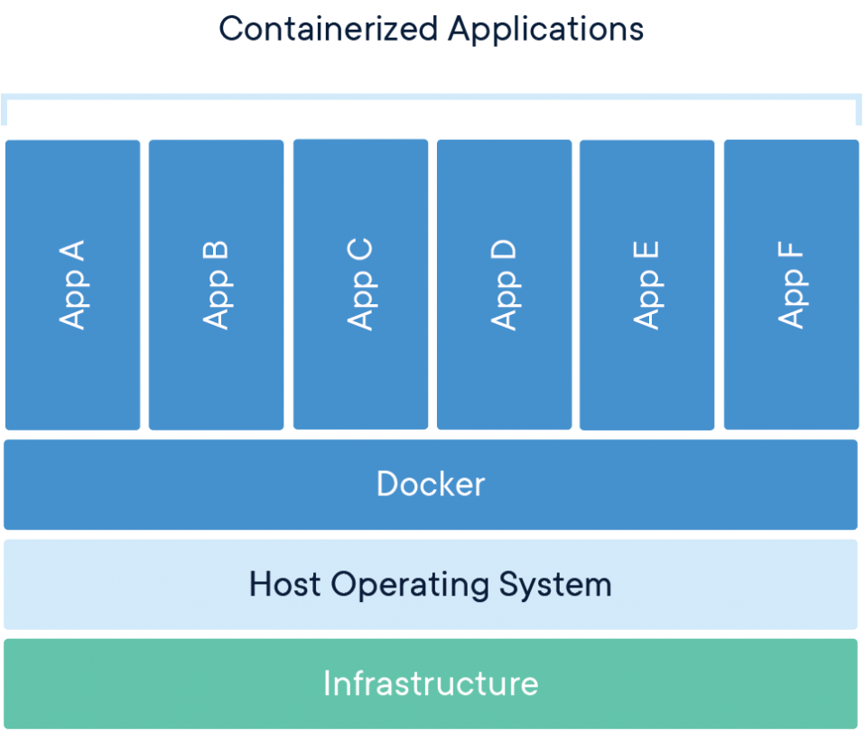
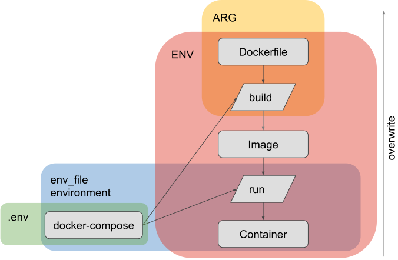
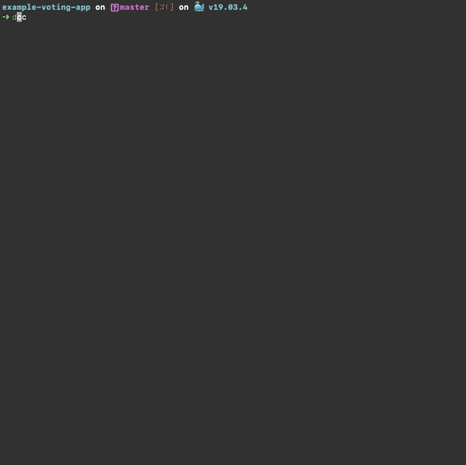
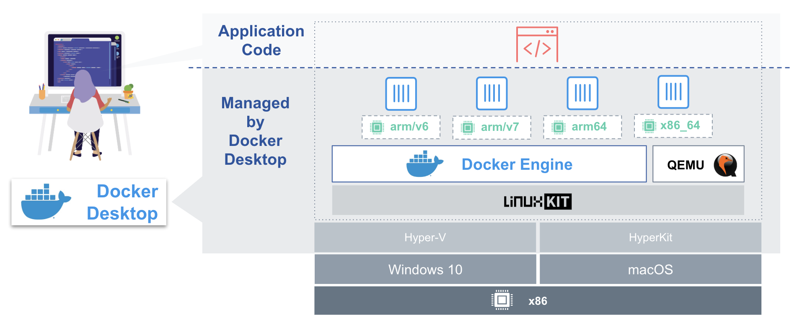
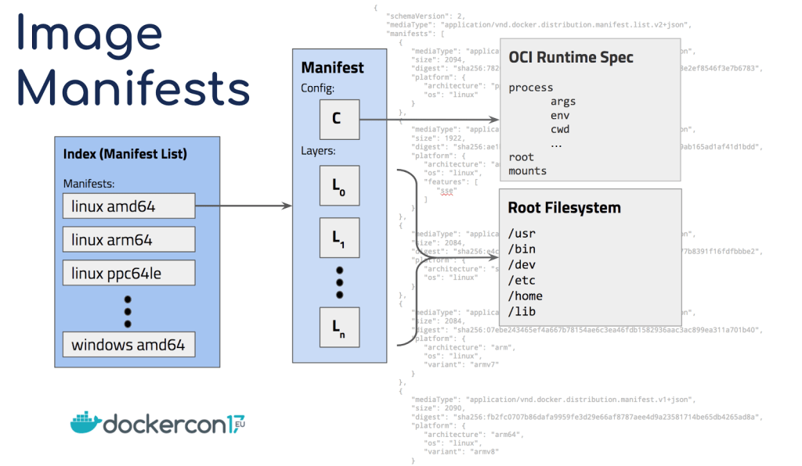

<!-- .slide: data-separator-vertical="by" data-background="https://images.pexels.com/photos/163726/belgium-antwerp-shipping-container-163726.jpeg" data-state="intro"-->

<!--PYSPELL-BEGIN-IGNORE-->

## Agenda
<!-- .slide: data-state="twocolul" -->

- Recap: What’s Docker
- BuildKit
- The most important Docker rules
- Docker and Docker Compose
- Bind Mounts / Volumes
- Handling Large Models
- ARG vs. ENV vs. .env vs. env_file
- Docker Secrets
- ENTRYPOINT vs. CMD vs. RUN
- Experimental BuildKit Mount Types
- Multi-Stage Docker Images
- Useful Tools: dive, lazydocker, dcc
- Multi-Architecture Images
- Docker Pitfalls

🤚 In a hands-on session we will interactively optimize an existing Dockerfile

## Recap: What's Docker?

[https://www.docker.com/resources/what-container](https://www.docker.com/resources/what-container)

### Docker Vocabulary

### Numbers and Facts

- 4 of 5 container runtimes are Docker
- 3 of 4 container orchestrators are Kubernetes
- 1 of 5 containers live less than 1 minute
- Half of the containers live less than 5 minutes
- Half of the images have security flaws
- Half of the images are replaced within 1 week

Source: [Sysdig 2019 Container Usage Report: New Kubernetes and security insights](https://sysdig.com/blog/sysdig-2019-container-usage-report/)

## New in the Docker World: BuildKit

BuildKit is a new building and packaging software for Docker

- 🔥 Build caches & mount types
- 🔥 Concurrent multistage builds
- 🔥 Multi CPU architecture builds (e.g. linux/amd64, linux/arm)

### Enabling BuildKit on your machine (Docker >= 18.09):

Command line

	docker buildx
		
	
	DOCKER_BUILDKIT=1 docker ...

Daemon config

	{ "features": { "buildkit": true }}

## The most important Docker rules

1. Reduce the size of our shipment, because it reduces
	- … the amount of required storage
	- … transferring times
	- … the attack surface
1. Reduce build time, because
	- …	only fast builds will be executed frequently
1. Make builds reproducible

## Dockerfile + docker-compose.yml

Standardized and reproducable definition of image name, runtime parameters, ports, volumes etc…

### Via Command Line only

	docker build . -t myveryspecialname:1.0
	
	docker run -p “8080:8080” -v “/var/folder:/sth:ro” myveryspecialname:1.0
		
- 👎 cannot be put into git
- 👎 easy to mess-up
- 👎 hard to remember
- 👎 individual for every image and machine

Custom builds scripts / makefiles are helping, but they are introducing individualism that is unwanted here

### Using the Docker-Compose file

Command Line
	
~~~bash
# old way: docker-compose build
docker buildx bake	

docker-compose up
~~~

docker-compose.yml

~~~yaml
image: myveryspecialname:1.0
build: .
ports:
 - 8080:8080
volumes:	
 - "/var/somespecialfolder:/sth:ro"
~~~

- 👍 can be versioned
- 👍 syntax highlighting and check
- 👍 write and forget - no remembering needed!
- 👍 works on all machines with every image 

## Bind Mounts and Volumes

[https://docs.docker.com/storage/bind-mounts/](https://docs.docker.com/storage/bind-mounts/)

### Bind Mounts vs Volumes

- Bind Mounts allow to share a file or folder with the host system
  - Useful for config files or important data
  - Allows to ship external data alongside docker-compose.yml
- Volumes allow to persist a file or folder across container instances
  - Useful for temp data such as indecies or caches
  - Not really portable

### Performance of Bind Mounts

- Performance depends on the guaranteed level of consistency
	- “like native” on Linux (VFS)
	- “it depends” on macOS / Windows (non-VFS hosts)
- the consistency expectation can be defined (since 17.04)
	- `consistent` - default, perfect consistency, expensive
	- `cached` - the host’s view is authoritative
	- `delegated` - the container’s view is authoritative

Source: [https://docs.docker.com/storage/bind-mounts/](https://docs.docker.com/storage/bind-mounts/)

### Example for an Bind Mount (new syntax)
~~~yml
services:
  service:
    volumes:
      - type: bind
        source: ${PWD}/data/
        target: /data
        consistency: cached
        read_only: true
~~~

## Handling Large Data Dependencies

The real question is: what is your usage scenario?

### One strategy to tackle large data dependencies

- Bake it into the image 🤔

### Further strategies to tackle large data dependencies

- Streaming Platforms - [Apache Kafka](https://kafka.apache.org/), [RabbitMQ](https://www.rabbitmq.com/), ...
- Database Clusters - [Elastic](https://www.elastic.co/guide/en/elasticsearch/reference/6.2/modules-cluster.html), [PostgreSQL](https://www.postgresql.org/docs/9.0/creating-cluster.html), ...
- Database-as-a-Service - [Azure SQL Database](https://azure.microsoft.com/de-de/services/sql-database/), [Amazon DocumentDB](https://aws.amazon.com/de/documentdb/), ...
- Blob Storages - [Amazon S3](https://aws.amazon.com/de/s3/), [Google Cloud Storage](https://cloud.google.com/storage/), ...
- Model Server - [TensorFlow Serving](https://www.tensorflow.org/tfx/guide/serving), [Clipper](http://clipper.ai/), [TensorRT](https://github.com/NVIDIA/tensorrt-inference-server)
- Distributed File Systems - [Ceph-FS](https://docs.ceph.com/docs/master/cephfs/), [GlusterFS](https://www.gluster.org/), ...

## ARG vs. ENV vs. .env vs. env_file

Hierarchy and scope of variables in Docker

- Dockerfile variable definitions
	- Arguments (valid during build)

		~~~dockerfile
		ARG myvar=variable
		~~~
	- Environment variables (valid during build and run)

		~~~dockerfile
		ENV myvar=variable
		~~~

- Docker-Compose variable definitions
	- Environment statement (valid during run)
		~~~yaml
		environment:
			myvar=${SYSENV:-variable}
		~~~

	- env_file statement (valid during run)

			env_file: env_file_name

## Passwords in Environment Variables?

This violates the **principle of least privilege** and the **principle of least astonishment**:

1. Environment variables are clear text
1. Environment variables are easy to read on the host
1. Environment variables are inherited to all child-processes
1. Environment variables are often logged for debugging

Source: [https://diogomonica.com/2017/03/27/why-you-shouldnt-use-env-variables-for-secret-data/](https://diogomonica.com/2017/03/27/why-you-shouldnt-use-env-variables-for-secret-data/)

### People do not seem to care

## Secrets
<!-- .slide: data-background="red" data-background-transition="zoom" -->

Handling secrets the _Docker way_ involves two steps:

1. Use what Docker provided to us for passwords
2. Adjust our Docker image entrypoint

### Use what Docker provided to us for passwords

1. Define the secret with a **name** and with a **reference to a txt file**
1. Assign the secret to a container. 

		services:
		  service:
		    secrets:
		      - my_secret
		secrets:
		  my_secret:
		    file: ./my_secret.txt

1. Inside the container, the secrets is available at

		/run/secrets/name

### Adjust our Docker image entrypoint

4. Instead of defining the password via environment variable

		SQL_DB_PASSWORD=mysecretpassword
			
 It is current practice to add the suffix **_FILE** and to refer to a secret path

		SQL_DB_PASSWORD_FILE=/run/secrets/sql-db-password
1. Custom entrypoint scripts resolve the path in SQL_DB_PASSWORD_FILE and create a local variable SQL_DB_PASSWORD with its content. Example: [MySQL Entrypoint](https://github.com/docker-library/mysql/blob/master/5.6/docker-entrypoint.sh)

~~~bash
# usage: file_env VAR [DEFAULT]
#    ie: file_env 'XYZ_DB_PASSWORD' 'example'
# (will allow for "$XYZ_DB_PASSWORD_FILE" to fill in the value of
#  "$XYZ_DB_PASSWORD" from a file, especially for Docker's secrets feature)
file_env() {
	local var="$1"
	local fileVar="${var}_FILE"
	local def="${2:-}"
	if [ "${!var:-}" ] && [ "${!fileVar:-}" ]; then
		mysql_error "Both $var and $fileVar are set (but are exclusive)"
	fi
	local val="$def"
	if [ "${!var:-}" ]; then
		val="${!var}"
	elif [ "${!fileVar:-}" ]; then
		val="$(< "${!fileVar}")"
	fi
	export "$var"="$val"
	unset "$fileVar"
}
~~~
[MySQL entrypoint script](https://github.com/docker-library/mysql/blob/master/5.6/docker-entrypoint.sh)

## RUN, ENTRYPOINT, CMD

| Dockerfile statement | build phase | run phase | purpose |
|---|---|---|---|
| RUN | ✅ | | Execute an command, commit result into image |
| ENTRYPOINT |  | ✅ | Specify what to do when container is executed |
| CMD |  | ✅ | Augment ENTRYPOINT with addition parameters |

### Dockerfile
~~~dockerfile
RUN apt-get install glibc

ENTRYPOINT java /app.jar -serve
CMD -Xmx4G
~~~

### docker-compose.yml
~~~yaml
services:
  service:
	command: -Xmx=14G
~~~

## Experimental BuildKit Mount Types

<!-- .slide: data-background="https://i.giphy.com/90F8aUepslB84.gif" data-state="intro"-->

- A new experimental Dockerfile frontend syntax allows us to add cool new features to `RUN` commands:
		
		RUN --mount=type=<type>,target=<target> <path-to-app>	

- To enable the experimental frontend, add this line to your `Dockerfile`

		# syntax = docker/dockerfile:experimental

Source: [https://github.com/moby/buildkit/blob/master/frontend/dockerfile/docs/experimental.md](https://github.com/moby/buildkit/blob/master/frontend/dockerfile/docs/experimental.md)

### Bind mounts

	RUN --mount=type=bind,target=/sth/ cat /sth/lala

- Bind-mounts an external folder (read only)
- Suitable for large file dependencies or source code

### Cache mounts

	RUN --mount=type=cache,target=/root/.m2 mvn package
	
	RUN --mount=type=cache,target=/var/lib/apt/lists apt update
	
	RUN --mount=type=cache,target=/root/.cache/pip pip update
	
	RUN --mount=type=cache,target=/root/.cache/go-build go build

- Caches a specified folder across builds
- Suitable for dependencies and repositories

## Multi-Stage - Dos and Don'ts

### Good

~~~dockerfile
FROM ubuntu as build
RUN … // build your stuff here

FROM scratch
COPY --from=build artifact.bin /

ENTRYPOINT ./artifact.bin
~~~

### Bad

	FROM ubuntu as build
	RUN … // build your stuff here

	FROM alpine as base
	COPY --from=build artifact.bin /

	ENTRYPOINT ./artifact.bin

	FROM base as debug
	ENV	debug=1

	FROM base as prod
	ENV	debug=0
	ENV prod=1

- ⚠️ Images cannot be distinguished by their build stage
- ⚠️ Mix of configuration and the resulting build artifact

## Multi-Stage: Installing vs Base Images

The work from others can be integrated more easily.

Example scenario: The `git` command is required during the build of an image. What can we do?

### 186MB - Ubuntu

	FROM ubuntu # 64 MB

	# + 122 MB
	RUN   apt-get update && \
		apt-get install -y git

### 166MB - Ubuntu

	FROM ubuntu # 64 MB

	# + 102 MB
	RUN   apt-get update && \
		apt-get -y install --no-install-recommends \
		git

### 141MB - Ubuntu

	FROM ubuntu # 64 MB

	# + 77 MB
	RUN   apt-get update && \
		apt-get -y install --no-install-recommends \
		git \
		&& rm -rf /var/lib/apt/lists/*

Only 75% of the original installation!

### 22,6MB - alpine

	FROM alpine # 5,6 MB

	#  + 17 MB
	RUN   apk add --update git

### 21,6MB - alpine

	FROM alpine # 5,6 MB

	# + 16 MB
	RUN   apk add --no-cache --update git

Only 15% of the size of the smallest Ubuntu image 

### 28MB - alpine/git

	FROM   alpine/git # 28 MB

## Maven Dockerfile Boilerplate 2019

	# syntax = docker/dockerfile:experimental

	FROM    maven:3.5.0-jdk-8-alpine as build
	WORKDIR /app

	RUN     --mount=target=. --mount=type=cache,target=/root/.m2/ \
			mvn package -DbuildDirectory=/target

	FROM    openjdk:8-alpine
	RUN     apk add --no-cache --update curl
	WORKDIR /
	COPY    --from=build /target/*-standalone.jar /app.jar

	ENTRYPOINT ["java", "-jar", "/app.jar"]
	CMD		-Xmx=2G

	EXPOSE  8080

	HEALTHCHECK   --interval=2m --timeout=10s CMD\
				curl --fail http://0.0.0.0:8080/health || exit 1

### Experimental Mounts for the Maven execution

	RUN     --mount=target=. --mount=type=cache,target=/root/.m2/ \
			mvn package -DbuildDirectory=/target

- Mount bind of the external Java-Source folder
- No `COPY` of the sources, creation of one layer saved
- No previous dependency management, creation of another layer saved
- Cache mount of `/root/.m2/`, dependencies stored there will be cached across image builds

### Minor Maven modification

Maven must be instructed to use a different output directory, via

	-DbuildDirectory=/target
	
requires minor changes in the pom.xml:

		<project
			<properties>
				<buildDirectory>${project.basedir}/target</buildDirectory>
			
			<build>
			    <directory>${buildDirectory}</directory>

### Minimal footprint curl installation

	RUN     apk add --no-cache --update curl

### CMD augments ENTRYPOINT

	ENTRYPOINT ["java", "-jar", "/app.jar"]
	CMD		-Xmx=2G
	
- Allows to override application-specific parameters easily, without messing arround with the application execution
- For example, it is easy to assign more heap via docker-compose:

		version: "3.7"
	
		services:
		  service:
		  	build: .
		  	command: -Xmx=4G

### Built-in Healthcheck

	HEALTHCHECK   --interval=2m --timeout=10s CMD\
				curl --fail http://0.0.0.0:8080/health ||  exit 1
			
The container knows best how to monitor its health

## Nice Tools

dive, lazydocker, dcc

### Dive

A tool for exploring a docker image, layer contents, and discovering ways to shrink the size of your Docker/OCI image.

[https://github.com/wagoodman/dive](https://github.com/wagoodman/dive)

### lazydocker

A simple terminal UI for both docker and docker-compose.

[https://github.com/jesseduffield/lazydocker](https://github.com/jesseduffield/lazydocker)

### dcc

Builds and launches docker-compose services, monitors their output using multitail, opens exposed ports automatically in a browser.

[https://github.com/heussd/dotfiles/blob/master/scripts/.scripts/dcc](https://github.com/heussd/dotfiles/blob/master/scripts/.scripts/dcc)

## Hands-On Session

Demo Scenario: Publishing a Markdown file as static webpage with two dependencies

1. Clone [md-page](https://github.com/oscarmorrison/md-page) - JS that converts Markdown to HTML on the fly
1. Clone [my-way-to-view-things](https://github.com/heussd/my-way-to-view-things) - Timm's prefered CSS for text reading
1. Combine Readme.md + JS + CSS
1. Serve in static Web server

### We start with a Dockerfile like this

	FROM ubuntu

	# Install requirements
	RUN   apt-get update && apt-get install -y git lighttpd
	WORKDIR /var/www/html/

	# Pull dependencies
	RUN     git clone https://github.com/oscarmorrison/md-page
	RUN		git clone https://github.com/heussd/my-way-to-view-things

	# Copy sources
	COPY	img ./img/
	COPY    Readme.md ./

	# Build artifact
	RUN 	echo '<noscript>' > 'index.html' && \
				echo '<link rel="stylesheet" type="text/css" href="my-way-to-view-things/text-reading.css" media="screen" />' >> 'index.html' && \
				echo '' >> 'index.html' && \
				cat "Readme.md" >> 'index.html'

	# Serve artifact
	CMD ["lighttpd", "-D", "-f", "/etc/lighttpd/lighttpd.conf"]

### Deep-dive

1. apt command
	1. We see how many binaries are added for the git installation
	1. We see the apt caches that are added
1. clone command
	1. We notice the `.git` folders

### Fixing the Dockerfile

#### Replace the git commands
~~~dockerfile
FROM	alpine/git as git
WORKDIR	/git
RUN		git clone URL /git && \
		git checkout -q "COMMIT"
~~~

	
#### Introduce gostatic

[https://hub.docker.com/r/pierrezemb/gostatic](https://hub.docker.com/r/pierrezemb/gostatic)

#### Build with BuildKit

## Hands-on Recap

By following good practices and  🔥 Docker features, we drastically reduced build time and image size

- 97% size reduction
- 91% build time reduction
- Decreased the attack surface
- Increase scalability and reproducability

## Multi-Architecture Images

Image Source: [https://engineering.docker.com/2019/04/multi-arch-images/](https://engineering.docker.com/2019/04/multi-arch-images/)

### Image Manifests

Image Source: [https://www.docker.com/blog/multi-arch-all-the-things/](https://www.docker.com/blog/multi-arch-all-the-things/)

### How manifest lists look like

### How manifests look like

### How to use

~~~makefile
setup:
	docker buildx create --name "nubuilder" --use
build:
	docker buildx build --platform linux/amd64,linux/arm/v7 -t $(IMAGE_NAME) --push .
clean:
	docker buildx rm nubuilder
~~~

## Docker Pitfalls
<!-- .slide: data-background="https://www.handwerk.com/drimage/1120/630/3277/hide-pain-harold-title-red%20-web.jpg" data-state="intro"-->

### Terminology: Run 

- `RUN` in `Dockerfiles` runs **code during image build**.
- `docker run` runs **containers**.

### Terminology: Arguments, Commands

- **`ARGS`** are environment variables during the build phase.
- Runtime **arguments** can be specified using **`CMD`** (`Dockerfile`) or **`commands`** (docker-compose).
- **Docker commands** are command line parameters to the Docker binary (such as `docker images`).

### Scope of Environment Variables

- Environment variables in Dockerfile are respected during build.
- Environment variables in docker-compose are ignored during build (even if you build with `docker-compose build`)

### Terminology: Volumes and Mounts

- [**Volumes** are different from **bind mounts**](https://docs.docker.com/storage/volumes/)
- Both are specified, used and maintained with the keyword **volumes**.
- **Bind mounts** are **volumes** of the **type bind** in docker-compose:

		volumes:
	      - type: bind

### Volumes during build

- Volumes persist writes during run, but not during build.
- Writes during build are silently ignored without any warning.
- You cannot be sure what folder is an volume, as images can define arbitrary folders as volumes.

## Conclusion

- Build smaller images, faster
- Cache all the things
- Be multi-arch friendly

[https://github.com/heussd/docker-late-2019](https://github.com/heussd/docker-late-2019)